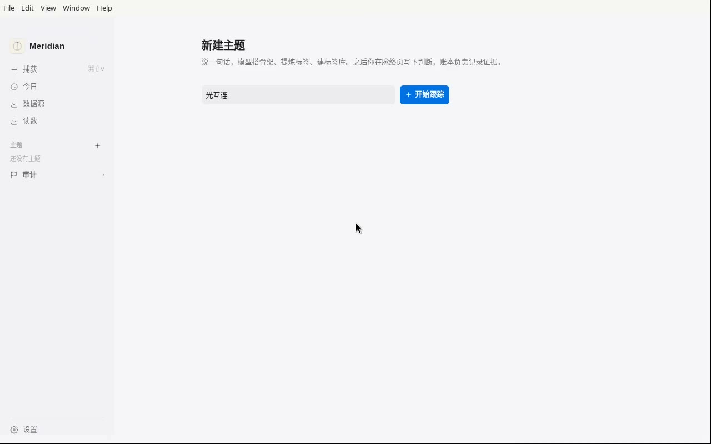
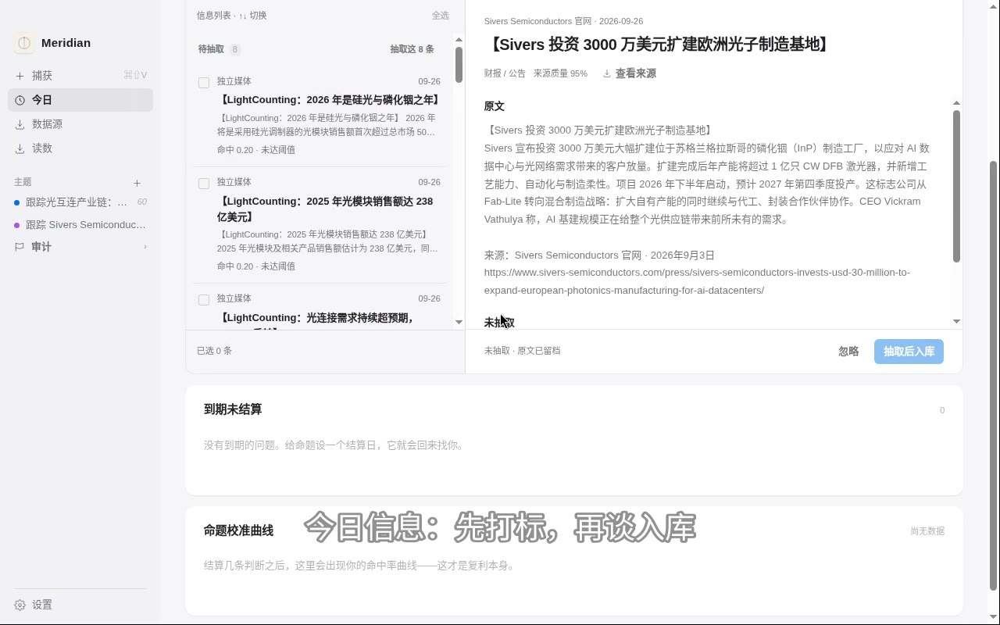

# Meridian

> 本地优先的判断账本：信息搬进来 → 归位到主题脉络 → 沿产业链传导 → 到期结算。
> 资产不是知识地图，是你的**校准曲线**。


---

## 演示

[](docs/demo.mp4)

*2 分 41 秒（点击封面播放）：新建「光互连」「咖啡」两个主题——真实大模型生成产业链骨架（三阶段：骨架 → 主题标签 → 标签库），展开传导树，回到今日视图。*

### 完整功能巡览（1.5×）

[](docs/tour.mp4)

*5 分 17 秒（1.5 倍速播放），十幕走完一条信息的完整旅程：*

| 时间 | 章节 |
| ---- | ---- |
| 0:00 | 个人知识账本：信息进来，变成可审计的知识 |
| 0:20 | 今日信息：先打标，再谈入库 |
| 1:10 | 手动捕获：机器不静默建节点 |
| 2:00 | 脉络：68 个节点，一棵树 |
| 2:50 | 读数：一指标一行，条条有来源 |
| 3:20 | 审计：采集漏斗与调用账本，每一步都有据可查 |
| 4:10 | 标签库：归位有依据 |
| 4:30 | 设置：全部真实调用，无 mock |
| 5:00 | 导出：账本可携带 |
| 5:15 | Meridian |

---

## 这是什么

Meridian 是一个桌面应用，帮你把日常读到的信息沉淀成**可复利、可结算的判断资产**。

它的工作方式和传统笔记/知识库不同：

- **你不写，只搬。** 信息来自复制粘贴和订阅源，日常动作是「确认」而不是「输入」。
- **按主题纵向组织。** 跟踪的是一条产业链（比如 AI 从上游到下游），而不是分类目录。
- **产业链是有方向的树。** 每条边带传导权重，上游命题的置信度一变，下游按权重同向衰减——上游 1 条证据变化，能击穿你 3 条下游判断，系统直接算给你看。
- **判断要结算。** 每条命题可设结算日，到期后回答「还想下这个注吗」，答案进入你的校准曲线：*我说 70% 有把握的事，到底发生了几次？*

所有数据存在本地一个 JSON 文件里，随时导出带走。

---

## 功能特性

**捕获**

- 全局热键 `⌘⇧V`：任何地方选中的文本，一个热键进收件箱
- 粘贴 URL 自动抓取网页正文，并按域名推断来源通道
- RSS / Atom 订阅源定时拉取，走同一条捕获流水线
- 不确定性闸门：能自动归位的信息直接入库，拿不准的才进收件箱

**组织**

- 一句话新建主题，三阶段冷启动：骨架 → 主题标签 → 标签库（每步可独立失败重试）
- 大模型生成主题骨架：纯文本行式大纲 + 客户端确定性解析，坏行只丢一个节点
- 环节脚手架：每个环节自带核心问题 / 跟踪指标 / 证伪信号
- 收件箱批量裁决，默认全选，零思考入库；自动归位可一键撤销

**传导**

- 传导权重边：上游置信度变化沿边衰减传导，深度衰减由复利自然产生
- 因果图 / 树形双视图，边上直接拖拽改权重，实时重算
- 跨主题共同前提扫描：一个前提动了，所有相关主题一起标出来

**结算**

- 命题结算日到期提醒（原生通知 + Dock 角标）
- 结算后进入校准曲线：只统计你亲手写的判断（`by:manual`），搬运和模型建议另算
- 结算脉冲动画：传导路径上的变化一眼可见

**信任**

- 来源打标器可替换：内置关键词查表（默认）/ Jev 原生协议（直连 `api.typesafe.ai`）
- 质量分一律由 `SOURCE_QUALITY` 表裁决，换模型不漂移基准
- 留痕层：每次模型介入的输入、输出、最终决策完整记录，可复现
- 误杀审计：被筛掉的内容留裁决记录，后来从别的源入库自动回填记为误杀

---

## 安装

### 环境要求

- macOS（窗口 vibrancy 与全局热键依赖桌面端）
- Node.js ≥ 18

### 步骤

```bash
git clone https://github.com/longyunBegin/meridian.git
cd meridian
npm install
npm start
```

> 曾用名「脉络」。改名后账本目录保持历史名称（`~/Library/Application Support/脉络/`），老用户数据不断链。

---

## 快速上手

### 1. 配置大模型（推荐）

打开 **设置（`⌘,`）**，填入任意 OpenAI 兼容服务的三件套：

| 项 | 说明 | 默认值 |
|---|---|---|
| Base URL | OpenAI 兼容端点 | `https://api.stepfun.com/v1` |
| API Key | 加密存储，机器绑定 | — |
| Model | 模型名 | `step-3.5-flash` |

没有 Key 也能用：收件箱会把整段原文存成一条观测命题，降级路径永远存在。

### 2. 配置来源打标（可选）

设置页可切换打标器：

- `table`（默认）：关键词启发式 + 质量表裁决，零依赖
- `jev`：Jev 原生协议，直连 `https://api.typesafe.ai/v1/systemone`，模型 `jev-latest`，一次取回 Choice / Score / Noul

打标失败静默降级到查表，不阻塞捕获。

### 3. 日常工作流

```
看到信息 → ⌘⇧V → 收件箱
        → 今日视图确认归位（批量默认全选）
        → 脉络视图看传导影响
        → 命题到期 → 结算 → 校准曲线 +1
```

### 4. 新建一个主题

侧边栏点 `+`，输入一句话（如"光互连"），三阶段自动跑完：

1. **骨架**：模型生成产业链大纲，你确认结构
2. **主题标签**：生成跨主题复用的标签
3. **标签库**：标签入库，后续归位自动匹配

任何一步失败都可单独重试，不影响已完成的步骤。

---

## 使用指南

### 视图

| 快捷键 | 视图 | 说明 |
|---|---|---|
| `⌘1` | 今日 | 开屏默认：待确认事项 + 到期结算 + 校准曲线 |
| `⌘2` | 脉络 | 主题工作区，树形 ↔ 因果图切换 |
| `⌘3` | 库 | 冷库 / 墓碑区 / 误杀审计 / 冲突 / 数据源 |
| `⌘,` | 设置 | 模型配置、打标器、导入导出 |

### 快捷键

| 按键 | 作用 |
|---|---|
| `⌘⇧V` | 全局粘贴到收件箱 |
| `⏎` | 新建兄弟节点 |
| `Tab` | 向下拆一层（子命题） |
| `↑` `↓` | 移动选择 |
| `⌘⌫` | 删除节点及子树（进墓碑区，可恢复） |

### 核心概念

- **命题（lemma）**：一条判断，带置信度、类型（公理 / 假设 / 观察）、结算日
- **环节（branch）**：产业链上的一个位置，挂核心问题 / 指标 / 证伪信号
- **传导权重**：边上的数字（0–1），上游置信度变化按此衰减传给下游
- **校准曲线**：只统计亲手写的判断，"70% 的把握到底对了几次"
- **墓碑区**：置信度跌破 20 的命题自动归墓，整棵子树可恢复

---

## 数据与隐私

- **本地优先**：判断层是单个 JSON，原文层是 JSONL，都在 `~/Library/Application Support/脉络/`，设置页一键打开
- **你的数据你带走**：随时导出 / 导入完整账本
- **密钥加密**：API Key 用 AES-256-GCM 加密落盘，密钥由机器信息派生，换机器读不出来
- **原文可清**：设置页可清理无引用原文或全清原文——判断、置信度、校准曲线不受影响
- **不上传**：除你配置的大模型 / 打标服务调用外，无任何网络外发

---

## 开发

```bash
npm test    # 引擎 + IPC + 改造测试（969 项，electron 已 stub，纯 Node 可跑）
npm start   # 启动应用
npm run shoot  # 视觉回归截图 → /tmp/meridian-shots/
```

```
src/
  main/            主进程：引擎（store.js）、抽取（extract.js）、打标（labeler.js）、
                   抓取（fetcher.js）、加密（crypto.js）、订阅源（feeds.js）、IPC（ipc.js）
  renderer/        渲染进程：无框架，原生 DOM；views/ 下是今日 / 脉络 / 图 / 库 / 设置
test/              engine.test.mjs / ipc.test.mjs / redesign.test.mjs / electron-stub.mjs
tools/shoot.mjs    视觉回归截图
docs/ROADMAP.md    迭代路线（按价值/成本排序）
```

提交规范：代码修改先走分支；`master` 每次推送需明确批准；测试数据不进仓库。

---

## 路线图

完整路线见 [`docs/ROADMAP.md`](docs/ROADMAP.md)，按 JEV/Effort 排序。近期完成：

- ✅ 行式大纲骨架（模型吐纯文本，客户端确定性解析）
- ✅ Jev 原生协议（直连 `api.typesafe.ai/v1/systemone`）
- ✅ 新建主题三阶段 UX（骨架 → 标签 → 标签库，部分失败可恢复）
- ✅ 更名 Meridian + 极简几何 Logo

明确不做：多端同步、协作分享、荐股信号、移动端——详见 ROADMAP。

---

## FAQ

**改名后我的老数据还在吗？**
在。产品显示名为 Meridian，但账本目录保持历史名称，老账本不断链。

**没有大模型 Key 能用吗？**
能。核心的搬运、归位、传导、结算都不依赖模型；收件箱降级为整段原文存成观测命题。

**支持 Windows / Linux 吗？**
暂不支持。全局热键与窗口 vibrancy 目前只做了 macOS。

**数据存在哪？**
`~/Library/Application Support/脉络/meridian.json`（判断层）+ 同目录 `raw.jsonl`（原文层）。

---

## 许可证

暂未声明开源许可证。如需使用或分发，请先联系作者确认。
