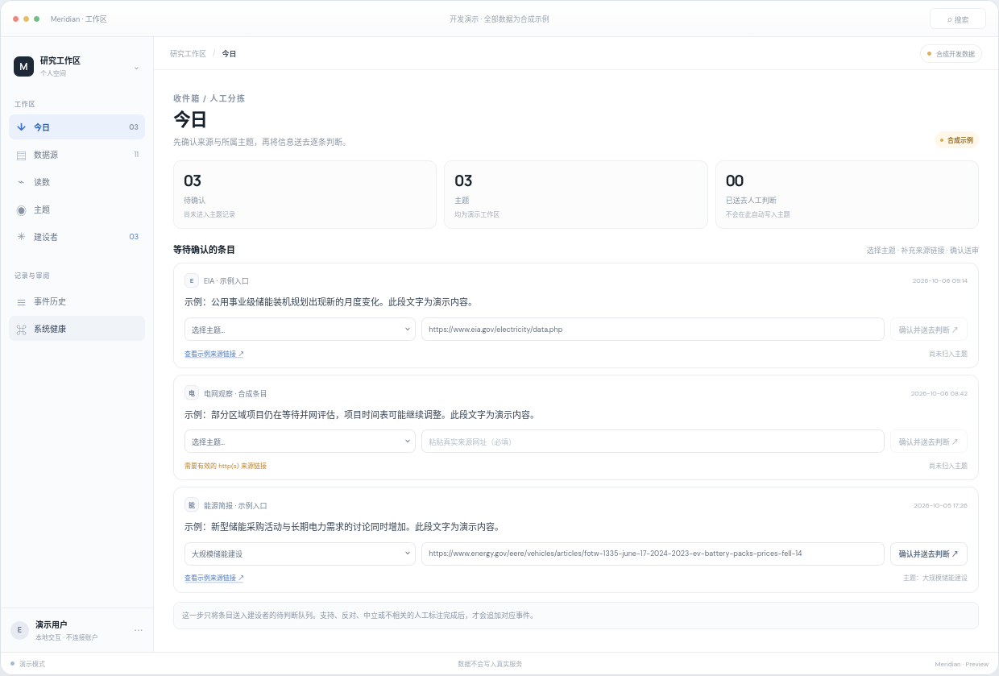

# Meridian

> 本地优先的研究工作台：捕获信息，由人审阅，再按主题对照读数、外部材料与变更历史。

Meridian 把分散的信息组织成可回看的主题脉络。来源链接、指标读数、人工表态和事件记录在同一个桌面工作流中呈现，帮助你检查材料从何而来、如何被归类；最终判断仍由人作出。它用于信息整理与审阅，不提供金融建议。

## 交互演示

[](docs/meridian-promo-demo.html)

[查看单文件交互演示源码](docs/meridian-promo-demo.html)。演示将 HTML、样式与交互脚本放在一个文件中，可下载后直接用浏览器打开，无需构建或部署。页面中的条目、读数、日期、来源描述和审计数字都是合成示例；示例外链只展示来源链接的形式，不佐证这些示例内容。交互状态只保留在当前页面，不会写入 Meridian 数据或连接产品服务。点击外部链接会打开相应网站。

## 工作流

1. **捕获并确认。** 新信息先进入「今日」收件箱。确认来源并指定所属主题后，再送往建设者逐条审阅。
2. **补足出处。** 外部数据需关联真实来源网页；来源和引文可在作出表态前检查。
3. **比较材料。** 在主题中并列查看指标读数，以及支持、反对和中立的外部数据。
4. **由人标注。** 在建设者中选择关联对象，并明确标注支持、反对、中立或不相关；确认后才写入主题记录。
5. **回看变更。** 通过事件序号检查历史状态，并在系统健康与审计视图查看收录漏斗等运行概况。

## 界面与功能

- **今日：** 查看待确认条目、来源与主题归属；可以按主题或处理状态筛选。满足来源链接和主题等要求后，条目才会送入人工审阅队列。
- **数据源：** 按来源类别分组查看来源条目与数量。来源链接用于打开原始页面；分组本身不替人判断内容是否成立。
- **读数：** 按日期查看指标和值，并区分「已披露」或「估算」口径，以及「单一来源」「需复核」等来源状态标记。
- **主题：** 阅读视图呈现主题原子、关联材料和支持／反对／中立分支；建设者视图负责处理待判断条目。两种视图共享主题记录，可按事件序号回放较早状态。
- **建设者：** 每条外部数据需关联真实来源网址，并由人选择支持、反对、中立或不相关后再确认写入。界面展示的权重由「来源类型 × 数据硬度」推导，用于说明材料权重的构成，不代替人工表态。
- **事件历史与系统健康：** 追加式事件记录保留操作者、时间、事件序号和变更内容；审计视图提供过滤器复核、收录漏斗及模型调用概况。事件历史用于在应用内追溯变化，不代表区块链级别的独立存证保证。

## 数据与网络访问

Meridian 采用本地优先的数据存储方式，桌面应用将业务记录保存在本机；当前实现支持 JSON 与 SQLite 持久层，原文内容由独立存储层管理。本地优先不等于离线：使用来源链接时，应用会请求相应网页；调用已配置的模型或其他来源服务时，请求会发往你设置的端点，完成该操作所需的文本或元数据可能随请求发送。可选同步、服务连接和更新检查也会按其配置访问网络。启用前请核对目标地址、密钥及服务方的数据处理方式。

## 开发

需要 Node.js，以及用于桌面构建的 Rust 与 Tauri 平台工具链。克隆仓库后可运行：

```bash
npm install
npm start                 # 启动 Tauri 桌面开发版
npm test                  # 运行领域逻辑、前端及服务适配测试
npm run build:ui          # 仅构建前端界面
```

前端界面位于 `src/renderer/`，主要业务与存储实现位于 `src/main/`，共享规则位于 `src/shared/`，桌面宿主位于 `src-tauri/`。Node 侧车与 Tauri 的集成说明见 [`docs/TAURI_MIGRATION.md`](docs/TAURI_MIGRATION.md)。

## 许可证

仓库当前未附许可证文件；如需使用或分发，请先与作者确认。
