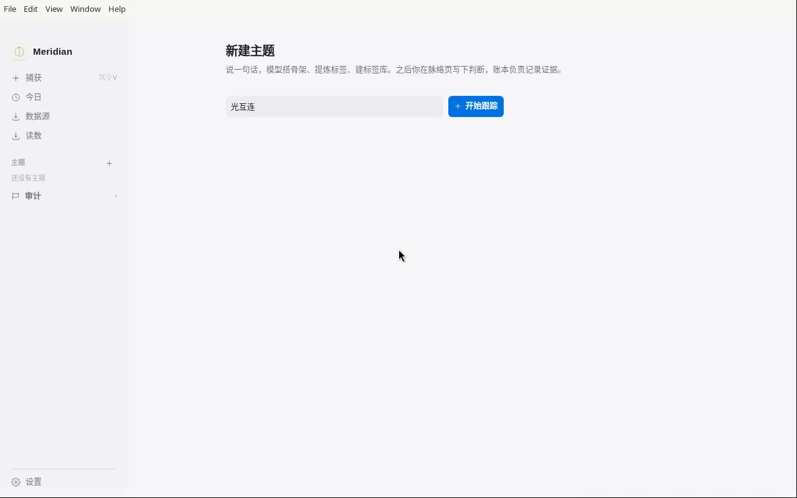
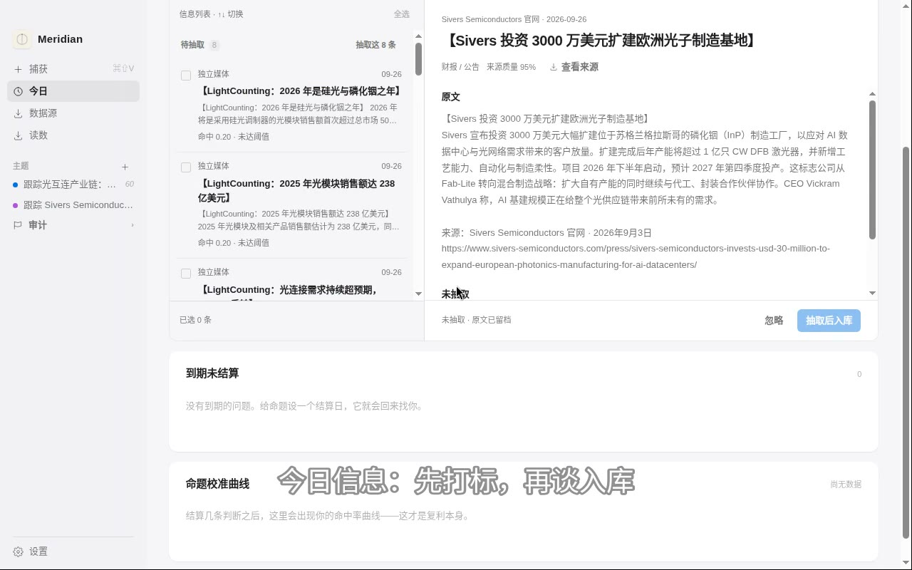

# Meridian

> 本地优先的判断账本：信息搬进来 → 归位到主题脉络 → 沿产业链传导 → 到期结算。
> 资产不是知识地图，是你的**校准曲线**。


---

## 演示

[](docs/demo-film.mp4)

*60 秒产品片《一根弦》（点击封面播放）：一条消息拨响一根弦 → 满屏噪音 → `⌘⇧V` 把一根弦理直、搬进来 → 一句话织出产业链 → 上游一拨，振动沿传导权重逐跳变轻，直到自己停下 → 到期结算，校准曲线一点点贴近对角线。*

*画面与弦音全部由代码生成（`node tools/film/film.mjs`）；片中的传导数字与校准命中率由真实引擎 `store.js` 计算，校准样本为合成数据。*

### 录屏：双主题骨架生成

[](docs/demo.mp4)

*2 分 41 秒（点击封面播放）：新建「光互连」「咖啡」两个主题——真实大模型生成产业链骨架（三阶段：骨架 → 主题标签 → 标签库），展开传导树，回到今日视图。*

### 完整功能巡览（1.5×）

[](docs/tour.mp4)

*5 分 17 秒（1.5 倍速播放），十幕走完一条信息的完整旅程：*

| 时间 | 章节 |
| ---- | ---- |
| 0:00 | 个人知识账本：信息进来，变成可审计的知识 |
| 0:20 | 今日信息：先打标，再谈入库 |
| 1:10 | 手动捕获：机器不静默建节点 |
| 2:00 | 脉络：68 个节点，一棵树 |
| 2:50 | 读数：一指标一行，条条有来源 |
| 3:20 | 审计：采集漏斗与调用账本，每一步都有据可查 |
| 4:10 | 标签库：归位有依据 |
| 4:30 | 设置：全部真实调用，无 mock |
| 5:00 | 导出：账本可携带 |
| 5:15 | Meridian |

---

## 这是什么

Meridian 是一个桌面应用，帮你把日常读到的信息沉淀成**可复利、可结算的判断资产**。

它的工作方式和传统笔记/知识库不同：

- **你不写，只搬。** 信息来自复制粘贴和订阅源，日常动作是「确认」而不是「输入」。
- **按主题纵向组织。** 跟踪的是一条产业链（比如 AI 从上游到下游），而不是分类目录。
- **产业链是有方向的树。** 每条边带传导权重，上游命题的置信度一变，下游按权重同向衰减——上游 1 条证据变化，能击穿你 3 条下游判断，系统直接算给你看。
- **判断要结算。** 每条命题可设结算日，到期后回答「还想下这个注吗」，答案进入你的校准曲线：*我说 70% 有把握的事，到底发生了几次？*

所有数据存在本地一个 JSON 文件里，随时导出带走。

---

## 功能特性

**捕获**

- 全局热键 `⌘⇧V`：任何地方选中的文本，一个热键进收件箱
- 粘贴 URL 自动抓取网页正文，并按域名推断来源
- 不确定性闸门：能自动归位的信息直接入库，拿不准的才进收件箱

**组织**

- 一句话新建主题，三阶段冷启动：骨架 → 主题标签 → 标签库（每步可独立失败重试）
- 大模型生成主题骨架：纯文本行式大纲 + 客户端确定性解析，坏行只丢一个节点
- 环节脚手架：每个环节自带核心问题 / 跟踪指标 / 证伪信号
- 收件箱批量裁决，默认全选，零思考入库；自动归位可一键撤销

**传导**

- 传导权重边：上游置信度变化沿边衰减传导，深度衰减由复利自然产生
- 因果图 / 树形双视图，边上直接拖拽改权重，实时重算
- 跨主题共同前提扫描：一个前提动了，所有相关主题一起标出来

**结算**

- 命题结算日到期提醒（原生通知 + Dock 角标）
- 结算后进入校准曲线：只统计你亲手写的判断（`by:manual`），搬运和模型建议另算
- 结算脉冲动画：传导路径上的变化一眼可见

**信任**

- 来源打标器可替换：内置关键词查表（默认）/ Jev 原生协议（直连 `api.typesafe.ai`）
- 来源可回溯：节点检查器的每条来源可点击跳转原文，抓取时的原文快照随时在应用内可查
- 质量分一律由 `SOURCE_QUALITY` 表裁决，换模型不漂移基准
- 留痕层：每次模型介入的输入、输出、最终决策完整记录，可复现
- 误杀审计：被筛掉的内容留裁决记录，后来从别的源入库自动回填记为误杀

---

## 安装

### 直接下载安装包（推荐）
从 [Releases](https://github.com/longyunBegin/meridian/releases) 下载：

适用于当前系统的最新版：

- **macOS（Apple Silicon）**：`Meridian_<version>_aarch64.dmg`。未配置 Apple Developer ID 签名或公证，首次安装可能显示 Gatekeeper「无法验证开发者」警告；右键点击应用并选择「打开」。这与应用内更新使用的 Tauri 更新包签名是两套不同机制。
- **Windows x64**：`Meridian_<version>_x64-setup.exe`（NSIS 安装包）。安装包未签名；若 SmartScreen 拦截，选择「仍要运行」。

### 应用内更新

- 从 v0.1.0 升级时，先从 GitHub Releases 手动安装一次带 updater 的 v0.1.2 引导版本（macOS 用 DMG，Windows 用 NSIS 安装包）。v0.1.0 没有 updater 插件或公钥，不能通过应用内更新跨越这一步。
- v0.1.2 及之后的桌面版启动时最多每 24 小时静默检查一次；设置页也可手动点「检查更新」。发现更新后会显示版本说明和下载进度，下载结束后由用户确认安装并重启。
- Tauri 构建会把应用版本写入更新包的签名可信注释；updater 强制校验签名版本与 manifest 一致，updater 与 Windows 安装器都拒绝降级。
- 发布工作流在推送 `vMAJOR.MINOR.PATCH` 标签或手动选择已有标签时构建 Apple Silicon macOS 与 Windows x64。每个平台先上传安装包和 `.sig`，再由一个汇总 job 生成同时包含 `darwin-aarch64`、`windows-x86_64` 的 `latest.json`，全部资产上传后才发布 Release。
- 发布前需在 GitHub 仓库 Actions secrets 中添加 `TAURI_SIGNING_PRIVATE_KEY`（Tauri updater 私钥文件的完整内容）；当前私钥未设密码，因此不需要密码 secret。私钥不可提交到仓库。只有私钥加密保存时才额外设置 `TAURI_SIGNING_PRIVATE_KEY_PASSWORD`。
- `TAURI_SIGNING_PRIVATE_KEY` 是 Tauri updater 的包签名密钥，不是 Apple Developer ID 证书；不需要新增 Apple credentials、签名或公证步骤。

### Windows 自行构建（可选）

1. 安装 [Node.js](https://nodejs.org) ≥ 22.13（LTS）和 [Rust](https://rustup.rs)（stable）
2. 安装 Visual Studio C++ 生成工具（勾选"使用 C++ 的桌面开发"工作负载）；WebView2 运行时（Win10/11 一般自带）
3. 拉代码、装依赖、构建：

```powershell
git clone https://github.com/longyunBegin/meridian.git
cd meridian
npm install
npm run tauri:build
```

产物在 `src-tauri\target\release\bundle\nsis\`。安装时 SmartScreen 拦截选"仍要运行"（未签名）。

### 从源码运行（开发）

环境要求：macOS 或 Windows、Node.js ≥ 22.13、Rust stable，以及对应平台的 Tauri 构建工具链。Windows 需要 MSVC C++ 构建工具和 WebView2；macOS 需要 Xcode Command Line Tools。

```bash
git clone https://github.com/longyunBegin/meridian.git
cd meridian
npm install
npm start
```

`npm start` 使用 Tauri 2。发布构建在目标系统本机执行：macOS 生成 DMG，Windows 生成 NSIS 安装包；当前不配置 Linux 或跨平台交叉编译。

> 曾用名「脉络」。改名后账本目录保持历史名称（`~/Library/Application Support/脉络/`），老用户数据不断链。

---

## 快速上手

### 1. 配置大模型（推荐）

打开 **设置（`⌘,`）**，填入任意 OpenAI 兼容服务的三件套：

| 项 | 说明 | 默认值 |
|---|---|---|
| Base URL | OpenAI 兼容端点 | `https://api.stepfun.com/v1` |
| API Key | 加密存储，机器绑定 | — |
| Model | 模型名 | `step-3.5-flash` |

没有 Key 也能用：收件箱会把整段原文存成一条观测命题，降级路径永远存在。

### 2. 配置来源打标（可选）

设置页可切换打标器：

- `table`（默认）：关键词启发式 + 质量表裁决，零依赖
- `jev`：Jev 原生协议，直连 `https://api.typesafe.ai/v1/systemone`，模型 `jev-latest`，一次取回 Choice / Score / Noul

打标失败静默降级到查表，不阻塞捕获。

### 3. 日常工作流

```
看到信息 → ⌘⇧V → 收件箱
        → 今日视图确认归位（批量默认全选）
        → 脉络视图看传导影响
        → 命题到期 → 结算 → 校准曲线 +1
```

### 4. 新建一个主题

侧边栏点 `+`，输入一句话（如"光互连"），三阶段自动跑完：

1. **骨架**：模型生成产业链大纲，你确认结构
2. **主题标签**：生成跨主题复用的标签
3. **标签库**：标签入库，后续归位自动匹配

任何一步失败都可单独重试，不影响已完成的步骤。

---

## 使用指南

### 视图

| 快捷键 | 视图 | 说明 |
|---|---|---|
| `⌘1` | 今日 | 开屏默认：待确认事项 + 到期结算 + 校准曲线；读数冲突从摘要进读数页裁决 |
| `⌘2` | 数据源 | 来源接入与连接状态 |
| `⌘3` | 读数 | 观测读数时间线 |
| 侧栏 | 收纳与审计 | 冷库 / 归档 / 系统健康 |
| `⌘,` | 设置 | 模型配置、打标器、导入导出 |

### 快捷键

| 按键 | 作用 |
|---|---|
| `⌘⇧V` | 全局粘贴到收件箱 |
| `⏎` | 新建兄弟节点 |
| `Tab` | 向下拆一层（子命题） |
| `↑` `↓` | 移动选择 |
| `⌘⌫` | 删除节点及子树（可撤销恢复） |

### 核心概念

- **命题（lemma）**：一条判断，带置信度、类型（公理 / 假设 / 观察）、结算日
- **环节（branch）**：产业链上的一个位置，挂核心问题 / 指标 / 证伪信号
- **传导权重**：边上的数字（0–1），上游置信度变化按此衰减传给下游
- **校准曲线**：只统计亲手写的判断，"70% 的把握到底对了几次"
- **墓碑区**：置信度跌破 20 的命题自动归墓，整棵子树可恢复

---

## 数据与隐私

- **本地优先**：判断层是 JSON/SQLite，原文层是 JSONL；macOS 存于 `~/Library/Application Support/脉络/`，Windows 存于 `%APPDATA%\脉络\`，设置页可一键打开
- **你的数据你带走**：随时导出 / 导入完整账本
- **密钥加密**：API Key 用 AES-256-GCM 加密落盘，密钥由机器信息派生，换机器读不出来
- **原文可清**：设置页可清理无引用原文或全清原文——判断、置信度、校准曲线不受影响
- **不上传账本**：自动更新只向 GitHub 查询版本并下载带签名的应用更新包，不上传本地判断、原文或设置；其他网络请求仅来自你配置的大模型 / 打标服务

---

## 开发

```bash
npm test                 # 引擎、领域命令、业务回归与 Tauri 侧车集成测试
npm run build:ui         # 只构建前端，不需要原生桌面库
npm run tauri:dev        # 启动桌面开发版，需要本机 Tauri 工具链
npm run tauri:prepare    # 为发布包暂存本机 Node 运行时
npm run tauri:build      # macOS DMG 或 Windows NSIS 安装包
```

Tauri 宿主只负责原生桌面能力；随包 Node 侧车通过平台无关的命令注册表承载业务和存储，保留账本、捕获、模型接入及可选同步行为。Node 24.19.0 在本机测得 126 MB 原始体积（gzip -6 后 44.3 MB），因此当前方案不是纯 Rust 的最小体积方案。完整说明见 [`docs/TAURI_MIGRATION.md`](docs/TAURI_MIGRATION.md)。

```
src-tauri/         Tauri 2 Rust 宿主、权限和平台打包配置
src/tauri/         Node 业务侧车与受限 loopback JSON-RPC 桥接
src/main/          领域服务：引擎、捕获、加密、存储与命令注册表
src/renderer/      原生 DOM 前端；Tauri bridge 保留原 renderer API
test/              业务回归、服务适配器和 Tauri 侧车集成测试
tools/             Node 运行时打包暂存工具
docs/ROADMAP.md    迭代路线（按价值/成本排序）
```

提交规范：代码修改先走分支；`master` 每次推送需明确批准；测试数据不进仓库。

---

## 路线图

完整路线见 [`docs/ROADMAP.md`](docs/ROADMAP.md)，按 JEV/Effort 排序。近期完成：

- ✅ 行式大纲骨架（模型吐纯文本，客户端确定性解析）
- ✅ Jev 原生协议（直连 `api.typesafe.ai/v1/systemone`）
- ✅ 新建主题三阶段 UX（骨架 → 标签 → 标签库，部分失败可恢复）
- ✅ 收件箱批量分拣 + 主题可选
- ✅ 节点来源可点击跳转原文
- ✅ Mac ↔ VM 双向同步
- ✅ 自动更新器（应用内检查 / 下载 / 签名验证 / 安装重启）
- ✅ Windows 预编译安装包（NSIS，随 Release 发布）
- ⏳ Linux 支持暂无计划
- ✅ 更名 Meridian + 极简几何 Logo

明确不做：多端同步、协作分享、荐股信号、移动端——详见 ROADMAP。

---

## FAQ

**改名后我的老数据还在吗？**
在。产品显示名为 Meridian，但账本目录保持历史名称，老账本不断链。

**没有大模型 Key 能用吗？**
能。核心的搬运、归位、传导、结算都不依赖模型；收件箱降级为整段原文存成观测命题。

**支持哪些桌面系统？**
macOS（Apple Silicon）和 Windows（x64）都提供预编译安装包；Linux 不支持。

**数据存在哪？**
macOS：`~/Library/Application Support/脉络/meridian.json`；Windows：`%APPDATA%\脉络\meridian.json`。原文层 `raw.jsonl` 位于同目录。

---

## 许可证

暂未声明开源许可证。如需使用或分发，请先联系作者确认。
